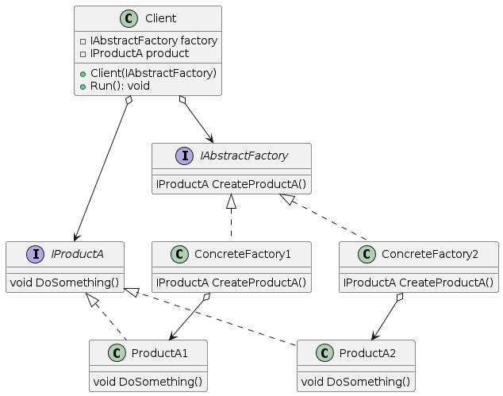
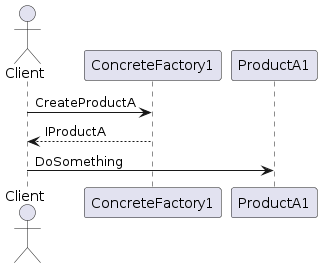
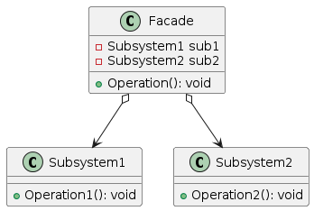
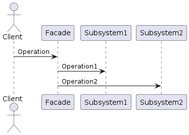
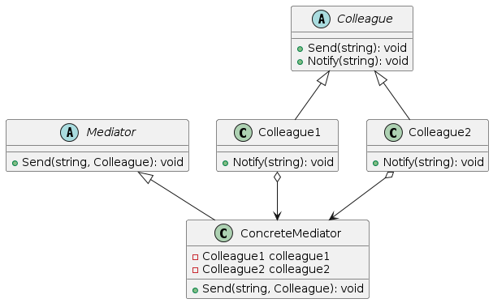
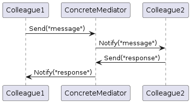
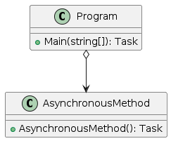
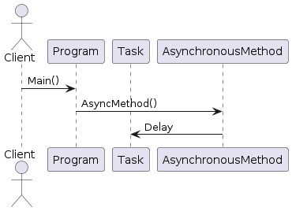

# Розрахунково графічна робота 
Розрахунково графічна робота на тему «Шаблони проектування»
В даній розрахунково графічній роботі буде розглянуто наступні шаблони проектування:Abstract factory, Facade, Mediator, Asynchronous method invocation.

## Абстрактна фабрика

### Опис
Шаблон "Абстрактна фабрика" надає інтерфейс для створення сімейств взаємопов'язаних або залежних об'єктів без вказівки їх конкретних класів. Цей шаблон корисний, коли системі потрібно бути незалежною від способу створення, складання та представлення своїх об'єктів.

### Статична модель 

### Динамічна модель 

## Фасад

### Опис
Шаблон "Фасад" надає спрощений інтерфейс до складної підсистеми. Він визначає високорівневий інтерфейс, що робить підсистему легшою у використанні.

### Реалізація
- [Facade.cs](./Facade/Facade.cs)

### Статична модель

### Динамічна модель

## Посередник (Mediator)

### Опис
Шаблон "Посередник" визначає об'єкт, що інкапсулює взаємодію множини об'єктів. Він сприяє слабкому зв'язуванню, не дозволяючи об'єктам явно посилатися один на одного, і дозволяє змінювати їхню взаємодію незалежно.

### Реалізація
- [Mediator.cs](./Mediator/Mediator.cs)

### Статична модель 

### Динамічна модель 

## Асинхронне викликання методів

### Опис
Шаблон "Асинхронне викликання методів" дозволяє методу повертатися до викликача негайно і виконуватись у іншому потоці. Це корисно для виконання тривалих операцій без блокування викликаючого потоку.

### Реалізація
- [AsynchronousMethodInvocation.cs](./AsynchronousMethodInvocation/AsynchronousMethodInvocation.cs)

### Статична модель 

### Динамічна модель 

